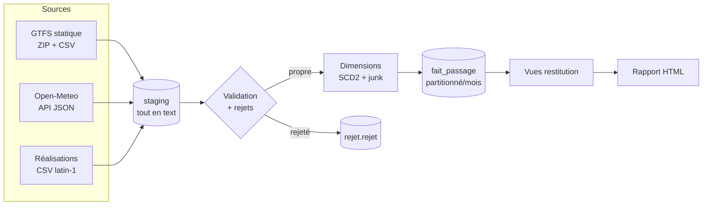

# Pipeline ETL & entrepôt décisionnel : Ponctualité du réseau STAR × météo

> Chargement de sources hétérogènes vers un entrepôt en **schéma en étoile** :
> nettoyage, dédoublonnage, gestion des rejets, historisation SCD2 et rapports
> automatisés. **Python · SQL · PostgreSQL.**

Cas d'usage réel et local : croiser la **ponctualité des bus et du métro de
Rennes** (réseau STAR, données ouvertes) avec les **conditions météo** (Open-Meteo),
pour répondre à des questions comme *« les bus sont-ils plus en retard quand il
pleut ? »* Et la réponse, mesurée sur 2,3 millions de passages, est **oui**.

---

## Ce que le projet démontre

| Compétence | Où la voir |
|---|---|
| Modélisation dimensionnelle (grain, faits, dimensions) | [`docs/01`](docs/01-modele-dimensionnel.md), `sql/ddl/` |
| Sources hétérogènes (ZIP/CSV, API JSON, CSV « sale ») | `src/mobilite/extraction.py`, `realisations.py` |
| Chargement massif performant (`COPY`, ×77 vs `INSERT`) | `src/mobilite/chargement.py` |
| Qualité : validation, rejets tracés, seuil d'alerte | [`docs/04`](docs/04-validation-rejets.md), `sql/transform/` |
| Dédoublonnage (exact et divergent) | `sql/transform/20_router_propre_rejet.sql` |
| Historisation **SCD2** par hash | [`docs/05`](docs/05-dimensions-scd2.md), `sql/transform/30_*` |
| Table de faits **partitionnée** | `sql/ddl/20_faits.sql`, `sql/transform/50_*` |
| Idempotence & journalisation d'exécution | `src/mobilite/base.py`, schéma `meta` |
| Rapports automatisés (Jinja2) | `src/mobilite/rapport.py` |
| Tableau de bord interactif (Chart.js) | `src/mobilite/dashboard.py` |
| Tests (70, dont intégration base) | `tests/` |

Chaque phase est documentée dans [`docs/`](docs/), avec les **décisions de
conception justifiées** et les **bugs rencontrés** : c'est le vrai récit du projet.

---

## Architecture

Le pipeline suit le motif **ELT** : on charge d'abord le brut, on valide ensuite.



### Le schéma en étoile

```
              dim_date        dim_creneau
                  \               /
   dim_ligne ── fait_passage ── dim_arret
        (SCD2)     |     (grain :        (SCD2)
                   |      1 passage à un arrêt)
                dim_meteo
                (junk dimension)
```

- **Grain** : un passage de véhicule à un arrêt, pour une course, à une date.
- **5 dimensions** : date, créneau horaire, ligne (SCD2), arrêt (SCD2), météo (junk).
- **Mesures** : retard (semi-additif), ponctualité, suppression, compteur.
- **Membre inconnu** (`sk = -1`) dans chaque dimension : les faits douteux sont
  conservés, jamais jetés : les totaux restent justes.

---

## Stack

- **PostgreSQL 18** : schémas séparés (`staging`, `entrepot`, `rejet`,
  `restitution`, `meta`), partitionnement par plage, `COPY`, procédures PL/pgSQL.
- **Python 3.11+** : `psycopg 3`, `requests`, `pandas` (extraction), `Jinja2`
  (rapport), `pytest`.
- Le rôle applicatif `mobilite_etl` est **sans privilège** (`NOSUPERUSER`) :
  seul le bootstrap exige l'administration.

---

## Installation

### Prérequis
- PostgreSQL 18 en service, et l'accès superutilisateur pour le seul bootstrap.
- Python 3.11 ou plus.

### Étapes

```bash
# 1. Environnement Python
python -m venv .venv
.venv/Scripts/activate            # Windows ;  source .venv/bin/activate sur Unix
pip install -r requirements.txt
pip install -e .

# 2. Configuration
cp .env.example .env
#   puis renseigner PGPASSWORD (et les autres valeurs si besoin) dans .env

# 3. Bootstrap : créer la base et le rôle applicatif (superutilisateur, une fois)
psql -U postgres -h localhost -d postgres -f sql/00_bootstrap_admin.sql
```

Le reste (schémas, tables, seeds, procédures, vues) est appliqué
**automatiquement** par le pipeline via son runner de migrations.

---

## Lancement

```bash
# Pipeline complet : extraction → chargement → validation → dimensions → faits → rapport
python -m mobilite

# Rejouer sans re-télécharger ni régénérer (données déjà présentes)
python -m mobilite --sans-extraction --sans-generation

# Reconstruction propre (vide faits et dimensions avant rechargement)
python -m mobilite --reinitialiser
```

À chaque exécution réussie, `rapports/` reçoit :
- `rapport_execution_*.html` : le rapport tabulaire (bilan, qualité, indicateurs) ;
- `dashboard_*.html` : un **tableau de bord interactif** (6 graphes Chart.js,
  autonome, ouvrable hors ligne) ;
- `dashboard_donnees_*.json` : les mêmes données, réutilisables par un autre outil.

### Collecte temps réel (optionnel)

Le module `collecteur_rt.py` interroge le **vrai flux GTFS-RT** du réseau STAR et
écrit dans le même format que le simulateur : le pipeline ne fait pas la
différence. Il s'exécute en boucle sous un ordonnanceur :

```bash
python -m mobilite.collecteur_rt      # collecte en continu, ~1 fois/minute
```

---

## Résultats mesurés

Sur la fenêtre du feed (04/09 → 12/10/2026, lignes a, b, C1–C7) :

```
2 342 951 faits chargés   (partitions : 1,63 M septembre + 0,71 M octobre)
Ponctualité globale : 90,7 %   ·   retard moyen : 67,5 s
```

**Effet de la pluie** (la question fondatrice) :

| Précipitation | Retard moyen | Ponctualité |
|---|---:|---:|
| Aucune | 66 s | 91,0 % |
| Faible | 84 s | 87,0 % |
| Modérée | 91 s | 88,2 % |

**Heures de pointe** : 107 s (matin) et 104 s (soir), contre ~33 s en heures
creuses et 16 s la nuit.

---

## Structure du projet

```
sql/
  00_bootstrap_admin.sql       base + rôle (superutilisateur, une fois)
  ddl/                         schémas, dimensions, faits, staging, meta+rejets
  seed/                        calendrier (jours fériés calculés), créneaux
  transform/                   règles qualité, normalisation, routage,
                               SCD2, dim_meteo, faits, réinitialisation
  restitution/                 vues d'analyse
src/mobilite/
  config.py  journal.py        configuration typée, journalisation
  extraction.py                GTFS (ZIP/CSV) + météo (API JSON)
  realisations.py              simulateur d'export « sale »
  collecteur_rt.py             collecteur GTFS-RT réel (protobuf)
  base.py                      connexion, migrations, journal d'exécution
  chargement.py                COPY, orchestration, benchmark
  validation.py                validation + politique de seuil
  dimensions.py  faits.py      chargement SCD2 et table de faits
  rapport.py  gabarits/        rapport HTML (Jinja2)
  pipeline.py  __main__.py     orchestrateur bout-en-bout
tests/                         70 tests (unitaires + intégration base)
docs/                          récit détaillé de chaque phase
```

---

## Points techniques remarquables

- **`COPY` mesuré 77× plus rapide** que l'`INSERT` ligne à ligne (benchmark
  reproductible dans `chargement.py`).
- **Le piège GTFS des heures > 24 h** (`25:14:00` = 1 h 14 le lendemain) résolu
  nativement par `date + interval`. 60 000 passages concernés dans les données.
- **`timestamptz` partout** : correct au changement d'heure, là où un timestamp
  naïf casse.
- **Optimisation SQL mesurée, pas devinée** : le routage est passé de 285 s à
  ~110 s en identifiant la vraie cause (réévaluation de fonctions par l'inlining
  de CTE), corrigée par `WITH … AS MATERIALIZED`. Récit complet dans
  [`docs/04`](docs/04-validation-rejets.md).
- **Sécurité** : rôle sans privilège, protection anti-« Zip Slip » à l'extraction,
  échappement HTML systématique dans le rapport (une faille XSS a été attrapée
  par un test).

## Limites assumées

- La version GTFS « à venir » n'est publiée que lors d'un changement de service ;
  le cas de dédoublonnage inter-versions est donc démontré via les doublons de
  l'export d'exploitation.
- ~22 jours de la période sont au-delà de l'horizon de prévision météo : ces
  faits sont rattachés au **membre inconnu** météo (documenté, mesurable), et les
  exécutions quotidiennes comblent le trou.
- L'étape de faits prend ~470 s (jointures SCD2 par plage) ; une piste
  d'optimisation est décrite dans [`docs/06`](docs/06-table-de-faits.md) mais
  n'est pas justifiée à ce volume.

## Tests

```bash
pytest                 # 70 tests
```

Les tests base s'ignorent proprement (`skip`) si PostgreSQL est injoignable ; les
tests unitaires (conversion d'heures, configuration, filtres) tournent partout.

---

## Sources de données

- **Réseau STAR** (Keolis Rennes) : GTFS statique & GTFS-RT, via
  [transport.data.gouv.fr](https://transport.data.gouv.fr).
- **Open-Meteo** : archive et prévision horaires, sans clé d'API.
