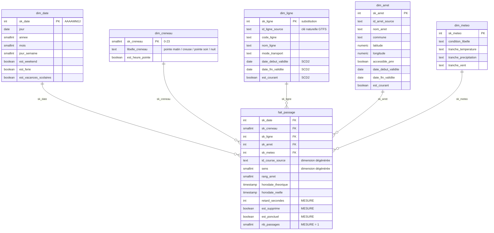

# Phase 1 — Conception du modèle dimensionnel

> Entrepôt décisionnel « Ponctualité & météo » — réseau STAR, Rennes Métropole.

---

## 1. La question à laquelle l'entrepôt doit répondre

Un entrepôt ne se conçoit **jamais** à partir des sources. Il se conçoit à partir des questions
métier. On les écrit **avant** de dessiner la moindre table :

1. Quel est le retard moyen par ligne, par mois ?
2. Les retards augmentent-ils quand il pleut ? De combien ?
3. Quels arrêts concentrent les retards en heure de pointe du soir ?
4. La ponctualité s'est-elle dégradée entre deux versions de l'horaire théorique ?
5. Quel est le taux de courses supprimées par jour de semaine ?

Chacune de ces questions se lit comme : **une mesure** (retard, taux) **par** **des axes d'analyse**
(ligne, mois, arrêt, créneau, météo). C'est exactement la définition d'un schéma en étoile :

- la **mesure** vit dans la **table de faits** ;
- les **axes** vivent dans les **tables de dimensions**.

---

## 2. Le grain — la décision la plus importante du projet

Le **grain**, c'est la réponse à : *« que représente exactement une ligne de ma table de faits ? »*

C'est la première décision à prendre et la plus coûteuse à changer. Kimball dit : *déclarez le grain
avant de choisir les dimensions et les faits*, parce que le grain détermine les deux.

### Grain retenu

> **Une ligne de `fait_passage` = le passage d'un véhicule à un arrêt donné, pour une course donnée,
> à une date de service donnée.**

Clé naturelle : `(date_service, id_course_source, id_arret_source, rang_arret)`.

### Pourquoi ce grain et pas un autre

| Grain candidat | Volume | Ce qu'on peut répondre | Verdict |
|---|---|---|---|
| 1 ligne = 1 jour × 1 ligne de bus | ~1 200 lignes/an | Q1, Q2 | Trop agrégé : Q3 (par arrêt) devient impossible |
| **1 ligne = 1 passage à un arrêt** | **~15 M/an** | **Q1 → Q5** | **Retenu** |
| 1 ligne = 1 position GPS (10 s) | ~2 Md/an | tout | Ingérable, et on n'en a pas besoin |

**Règle à retenir : on choisit toujours le grain le plus fin que les sources permettent et que le
volume autorise.** On peut toujours agréger un grain fin ; on ne peut jamais désagréger un grain
grossier. Les agrégats se font ensuite dans des vues (schéma `restitution`), pas en dégradant le fait.

Pour ce projet on restreindra le périmètre (quelques lignes fortes, ~3 mois) pour rester autour de
**2 à 5 millions de lignes** — assez pour que l'indexation et le partitionnement aient un sens réel,
assez peu pour tourner sur ton poste.

---

## 3. Le schéma en étoile



### 3.1 Pourquoi une étoile et pas un modèle relationnel normalisé (3NF) ?

| | 3NF (comme une base applicative) | Étoile (entrepôt) |
|---|---|---|
| Objectif | Éviter la redondance, écrire vite | Lire vite, être compréhensible |
| Jointures pour une question | 8 à 15 | **1 par axe, jamais en cascade** |
| Lisibilité pour un analyste | faible | forte |
| Redondance | interdite | **assumée** (le nom de ligne est répété des millions de fois) |

Dans un entrepôt on écrit une fois par nuit et on lit des millions de fois. On optimise donc la
lecture, quitte à dupliquer. C'est le renversement mental principal à faire.

### 3.2 Clés de substitution (*surrogate keys*)

Chaque dimension a une clé **artificielle**, entière, sans signification métier :
`sk_ligne`, `sk_arret`…

Pourquoi ne pas utiliser directement l'identifiant de la source (`route_id` GTFS) ?

1. **Les sources changent.** Rennes Métropole republie un GTFS toutes les 2–3 semaines ; les
   `route_id` peuvent être renumérotés. Ta table de faits ne doit pas exploser pour autant.
2. **Il faut plusieurs sources.** Demain tu ajoutes le réseau BreizhGo : ses identifiants entrent en
   collision avec ceux de STAR. Une clé de substitution règle le problème.
3. **L'historisation l'exige.** Avec du SCD2 (§4), la même ligne de bus existe en plusieurs versions.
   Il faut donc une clé par *version*, pas par *ligne*.
4. **Performance.** Un `integer` de 4 octets se joint et s'indexe bien mieux qu'un `text` de 30.

> Convention du projet : `sk_*` = clé de substitution, `id_*_source` = clé naturelle de la source.

### 3.3 Dimensions dégénérées

`id_course_source` (le `trip_id` GTFS) et `sens` restent **dans la table de faits**, sans dimension
associée. On appelle ça une **dimension dégénérée** : c'est un identifiant utile pour retrouver la
ligne d'origine ou compter des courses distinctes, mais qui n'a aucun attribut descriptif à porter.
Créer une `dim_course` à 500 000 lignes ne contenant que sa propre clé serait du gaspillage.

### 3.4 Le membre inconnu

Chaque dimension contient une ligne technique `sk_* = -1`, libellée « Inconnu ».

C'est essentiel : si un passage arrive avec un arrêt introuvable dans le référentiel, on a deux
options :
- le rejeter → on perd un fait réel, et le total des passages devient faux ;
- le rattacher au membre inconnu → **le fait est conservé**, la somme reste juste, et l'anomalie
  reste visible et mesurable (« 0,4 % des passages sur un arrêt inconnu »).

On choisit toujours la seconde pour ce cas. Les clés étrangères peuvent alors être `NOT NULL`, ce qui
garantit qu'aucune jointure ne perdra silencieusement des lignes.

---

## 4. Historisation : SCD2 sur `dim_ligne` et `dim_arret`

**SCD** = *Slowly Changing Dimension*, dimension à évolution lente. Le problème : l'arrêt
`Villejean-Université` est renommé `Villejean-Université — Campus` en mars. Que faire ?

| Type | Comportement | Conséquence |
|---|---|---|
| SCD1 | On écrase l'ancienne valeur | L'historique est réécrit : les rapports de janvier changent rétroactivement |
| **SCD2** | **On ferme l'ancienne ligne, on en insère une nouvelle** | **L'historique est fidèle** |
| SCD3 | On garde une colonne « valeur précédente » | Ne gère qu'un seul changement |

On retient **SCD2** pour `dim_ligne` et `dim_arret`, avec le triplet classique :

```
date_debut_validite | date_fin_validite | est_courant
2026-01-01          | 2026-03-14        | false        <- ancienne version
2026-03-15          | 9999-12-31        | true         <- version courante
```

Détection du changement : on calcule un **hash** (`md5`) de la concaténation des attributs suivis.
Si le hash diffère de celui de la version courante, il y a eu changement → on ferme et on réinsère.
C'est bien plus rapide et plus sûr que de comparer 12 colonnes une à une avec des `IS DISTINCT FROM`.

`dim_meteo` et `dim_creneau` ne sont pas historisées : ce sont des dimensions de référence figées.

---

## 5. Les mesures et leur additivité

C'est un point que les recruteurs aiment tester.

| Mesure | Type | Additivité |
|---|---|---|
| `nb_passages` (= 1) | compteur | **Additive** — sommable sur tous les axes |
| `est_supprime` | booléen | Additive une fois castée en 0/1 |
| `retard_secondes` | entier signé | **Semi-additive** — on peut faire `AVG`, `MAX`, `PERCENTILE`, mais `SUM(retard)` n'a aucun sens métier |
| `taux_ponctualite` | ratio | **Non additive** — un ratio ne se somme jamais. Il se recalcule : `SUM(est_ponctuel)/SUM(nb_passages)` |

**Règle : on ne stocke jamais un ratio dans une table de faits.** On stocke le numérateur et le
dénominateur, et le ratio se calcule à la volée. Sinon la moyenne de moyennes donne un résultat faux.

D'où la présence de `nb_passages = 1` : cette colonne qui semble idiote permet d'écrire
`SUM(nb_passages)` partout au lieu de `COUNT(*)`, ce qui reste correct même après agrégation
intermédiaire.

### Convention de ponctualité

`est_ponctuel = (retard_secondes BETWEEN -60 AND 180)`, c'est-à-dire : pas plus d'une minute d'avance,
pas plus de trois minutes de retard. C'est la convention usuelle des autorités organisatrices de
transport en France. Elle est **asymétrique** parce qu'un bus en avance est plus pénalisant pour
l'usager (il l'a raté) qu'un bus légèrement en retard.

---

## 6. Organisation en schémas PostgreSQL

On sépare les zones. Ce n'est pas cosmétique : c'est ce qui rend le pipeline **rejouable** et
**auditable**.

| Schéma | Rôle | Contenu typé ? | Vidé à chaque exécution ? |
|---|---|---|---|
| `staging` | Copie fidèle du brut, **tout en `text`** | Non | Oui (par lot) |
| `rejet` | Lignes refusées + motif | Oui | Non (on garde l'historique) |
| `entrepot` | Le schéma en étoile | Oui | Non |
| `restitution` | Vues d'agrégation pour l'analyse | — | — |
| `meta` | Journal des exécutions et des étapes | Oui | Non |

### Pourquoi `staging` est-il intégralement en `text` ?

Parce qu'un chargement ne doit **jamais** échouer sur un problème de format. Si tu déclares
`heure_arrivee TIME` et que le GTFS contient `25:14:00` (voir §7), le `COPY` plante et tu perds tout
le lot. En chargeant en `text`, l'ingestion réussit toujours, et la validation devient une étape
explicite, contrôlée, qui produit des rejets exploitables au lieu d'une erreur PostgreSQL.

C'est le principe **« charger d'abord, valider ensuite »** — ELT plutôt qu'ETL strict. C'est aussi ce
qui permet de rejouer une transformation sans re-télécharger les sources.

---

## 7. Les pièges de qualité déjà identifiés

Repérer les anomalies **avant** de coder, c'est ce qui distingue un pipeline sérieux d'un script.
Voici ce qu'on va devoir gérer en phase 4 :

| # | Anomalie | Source | Traitement prévu |
|---|---|---|---|
| 1 | **Heures > 24 h** : `25:14:00` signifie 1 h 14 le lendemain | GTFS `stop_times.txt` | Normalisation en horodatage réel (`date_service + interval`), pas un rejet |
| 2 | **Doublons entre versions GTFS** : le même `trip_id` livré deux fois | 2 exports GTFS successifs | Dédoublonnage sur clé naturelle + garde de la version la plus récente |
| 3 | **Horaires incohérents** : `arrivee > depart`, ou rang d'arrêt non croissant dans la course | GTFS | Rejet, sévérité *erreur* |
| 4 | **Retard aberrant** : > 2 h ou < −30 min | Export d'exploitation | Rejet, sévérité *erreur* (probable erreur de capteur) |
| 5 | **Arrêt orphelin** : `stop_id` absent de `stops.txt` | Intégrité référentielle | Rattachement au membre inconnu, sévérité *avertissement* |
| 6 | **Encodage** : export en `latin-1` avec des `é` | Fichier d'exploitation | Détection et transcodage à l'extraction |
| 7 | **Dates au format FR** `31/03/2026` vs ISO `20260331` | Sources mixtes | Normalisation à la validation |
| 8 | **Heure d'été** : la nuit du changement d'heure a 23 h ou 25 h | Tout horodatage | Stockage en `timestamptz`, calculs en `Europe/Paris` |
| 9 | **Météo manquante** sur un créneau | API | Rattachement au membre inconnu de `dim_meteo` |

Le point 1 est le piège GTFS classique, et le point 8 est celui que 90 % des candidats oublient.

---

## 8. Partitionnement de la table de faits

`fait_passage` est **partitionnée par plage sur `sk_date`**, un partition par mois.

Trois bénéfices concrets :

1. **Élagage de partitions** (*partition pruning*) : `WHERE sk_date BETWEEN 20260301 AND 20260331` ne
   lit qu'un seul partition, pas 12.
2. **Rechargement propre** : rejouer mars = `TRUNCATE` du partition de mars. Instantané, et sans le
   coût d'un `DELETE` de 400 000 lignes suivi d'un `VACUUM`.
3. **Purge** : supprimer les données de plus de 3 ans = `DROP TABLE` d'un partition.

Conséquence technique : la clé primaire doit **inclure la clé de partitionnement**. D'où
`PRIMARY KEY (sk_date, id_course_source, id_arret_source_hash, rang_arret)`.

---

## 9. Décisions de conception, résumées

| Décision | Choix | Alternative écartée |
|---|---|---|
| Grain | Passage à un arrêt | Course/jour (trop agrégé) |
| Modélisation | Étoile | Flocon (jointures en cascade, illisible) |
| Clés | Substitution `integer` | Clés naturelles (fragiles, collisions) |
| Historisation | SCD2 sur ligne et arrêt | SCD1 (falsifie l'historique) |
| Faits manquants | Membre inconnu `-1` | Rejet (fausse les totaux) |
| Zone brute | Tout en `text` | Typage à l'ingestion (chargements fragiles) |
| Horodatages | `timestamptz` | `timestamp` naïf (casse au changement d'heure) |
| Table de faits | Partitionnée par mois | Table unique (rechargements coûteux) |

---

## 10. Ce qui existe déjà après cette phase

```
sql/ddl/00_schemas.sql              -- les 5 schémas
sql/ddl/10_dimensions.sql           -- les 5 dimensions + membres inconnus
sql/ddl/20_faits.sql                -- fait_passage partitionnée
sql/ddl/30_meta_et_rejets.sql       -- journal d'exécution + table de rejets
sql/seed/10_peupler_dim_date.sql    -- génération du calendrier
sql/seed/11_peupler_dim_creneau.sql -- les 24 créneaux horaires
```

**Prochaine étape (phase 2)** : extraction des trois sources hétérogènes — GTFS (ZIP + CSV),
météo (API JSON Open-Meteo), et export d'exploitation (CSV « sale » en `latin-1`).
